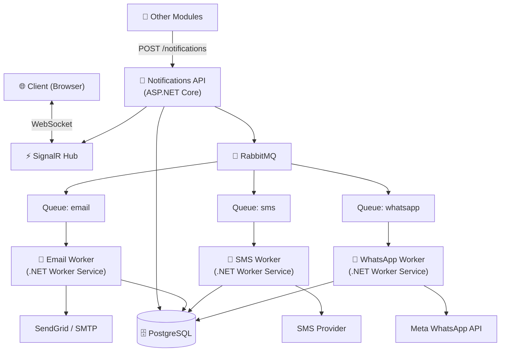
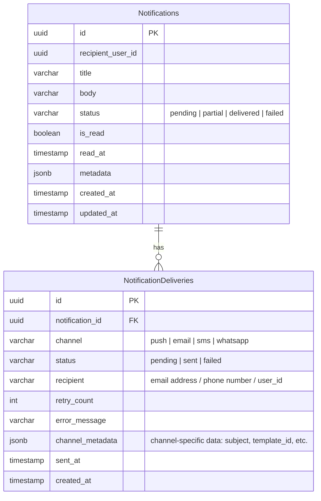

# 🔔 Notify Hub

A backend-focused microservice for sending and managing notifications across multiple channels: **Push (real-time)**, **Email**, **SMS**, and **WhatsApp**. Designed to be consumed by other modules/services via a centralized API.

## Table of Contents

- [Overview](#overview)
- [Architecture](#architecture)
- [Database Schema](#database-schema)
- [API Reference](#api-reference)
- [Real-Time (SignalR)](#real-time-signalr)
- [Tech Stack](#tech-stack)
- [Running the Demo](#running-the-demo)
- [Architecture Decision Records](./docs/adr/)
- [Contributing](./CONTRIBUTING.md)

---

## 📋 Overview

This service exposes a simple API that any module can call to send a notification to a user. Internally, it handles:

- **Push notifications** delivered in real-time via SignalR to the user's browser
- **Email, SMS, and WhatsApp** queued asynchronously via RabbitMQ and processed by dedicated Worker Services
- Per-channel delivery tracking with retry support

The service does **not** manage users — it accepts a `recipientUserId` (UUID) as an external reference, consistent with how this would work in a real microservices environment.

---

## 🏗️ Architecture



**Key design decisions:**

- Push notifications are delivered synchronously via SignalR — no queue needed, low latency.
- Email, SMS, and WhatsApp go through RabbitMQ queues to decouple the API from external provider latency and failures.
- Each channel has its own Worker Service, allowing independent scaling and failure isolation.
- The API returns `202 Accepted` immediately — processing is async.
- All infrastructure (RabbitMQ, PostgreSQL) runs locally via docker compose — no cloud account required to run the demo.

---

## 🗄️ Database Schema



**Notes:**

- `Notifications` holds the canonical record. `status` is the aggregated delivery status — if one channel fails and another succeeds, it becomes `partial`.
- `NotificationDeliveries` holds one row per channel. Workers update this after each attempt.
- `is_read` / `read_at` only apply to push notifications — they reflect whether the user has opened the notification in the UI.
- `channel_metadata` stores channel-specific fields (e.g. email subject, WhatsApp template ID) as JSON to avoid sparse columns across channel types.
- Adding a new channel (e.g. Telegram) requires no schema changes — just a new worker and a new queue.

---

## 📡 API Reference

### `POST /notifications`

Used by other modules to trigger a notification. The `channels` field maps each channel name to its recipient address.

| Channel | Recipient value |
|---|---|
| `push` | `recipientUserId` (UUID as string) |
| `email` | email address |
| `sms` | phone number (E.164) |
| `whatsapp` | phone number (E.164) |

**Request:**
```json
{
  "recipientUserId": "3fa85f64-5717-4562-b3fc-2c963f66afa6",
  "title": "Your request was approved",
  "body": "Request #1234 has been approved by the compliance team.",
  "channels": {
    "push": "3fa85f64-5717-4562-b3fc-2c963f66afa6",
    "email": "user@example.com"
  }
}
```

**Response `201 Created`:**
```json
{
  "id": "3fa85f64-5717-4562-b3fc-2c963f66afa6",
  "recipientUserId": "3fa85f64-5717-4562-b3fc-2c963f66afa6",
  "title": "Your request was approved",
  "body": "Request #1234 has been approved by the compliance team.",
  "status": "pending",
  "isRead": false,
  "readAt": null,
  "createdAt": "2025-01-15T10:30:00Z",
  "updatedAt": "2025-01-15T10:30:00Z",
  "deliveries": [
    {
      "id": "a1b2c3d4-...",
      "channel": "push",
      "status": "sent",
      "recipient": "3fa85f64-5717-4562-b3fc-2c963f66afa6",
      "retryCount": 0,
      "errorMessage": null,
      "sentAt": "2025-01-15T10:30:00Z",
      "createdAt": "2025-01-15T10:30:00Z"
    },
    {
      "id": "e5f6g7h8-...",
      "channel": "email",
      "status": "pending",
      "recipient": "user@example.com",
      "retryCount": 0,
      "errorMessage": null,
      "sentAt": null,
      "createdAt": "2025-01-15T10:30:00Z"
    }
  ]
}
```

> Push delivery is processed synchronously and will already show `sent` in the response. Async channels (email, sms, whatsapp) will show `pending` until their worker processes them.

---

### `GET /notifications/{id}`

Returns the full details of a notification including all delivery attempts.

**Response `200 OK`:** same shape as the `POST` response above.

**Response `404 Not Found`** if the notification does not exist.

---

### `GET /notifications`

Returns a paginated list of notifications for a user. Consumed by the frontend bell component.

**Query params:**

| Param | Type | Required | Default |
|---|---|---|---|
| `userId` | `guid` | yes | — |
| `page` | `int` | yes | — |
| `pageSize` | `int` | yes | — |
| `unreadOnly` | `bool` | yes | — |

**Response `200 OK`:**
```json
{
  "items": [
    {
      "id": "3fa85f64-5717-4562-b3fc-2c963f66afa6",
      "recipientUserId": "3fa85f64-5717-4562-b3fc-2c963f66afa6",
      "title": "Your request was approved",
      "body": "Request #1234 has been approved.",
      "status": "delivered",
      "isRead": false,
      "readAt": null,
      "createdAt": "2025-01-15T10:30:00Z",
      "updatedAt": "2025-01-15T10:30:01Z",
      "deliveries": []
    }
  ],
  "totalCount": 48,
  "page": 1,
  "pageSize": 20
}
```

---

### `GET /notifications/unread-count`

Returns the unread push notification count for a user. Used by the bell icon badge.

**Query params:** `userId` (guid, required)

**Response `200 OK`:**
```json
{
  "count": 5
}
```

---

### `PATCH /notifications/{id}/read`

Marks a single notification as read and emits an `UnreadCountUpdated` SignalR event.

**Response `204 No Content`**

**Response `404 Not Found`** if the notification does not exist.

---

### `PATCH /notifications/read-all`

Marks all unread notifications as read for a user and emits an `UnreadCountUpdated` SignalR event with `count: 0`.

**Query params:** `userId` (guid, required)

**Response `204 No Content`**

---

## ⚡ Real-Time (SignalR)

The frontend connects to `NotificationsHub` on load. The server emits two events:

| Event | Triggered when | Payload |
|---|---|---|
| `NewNotification` | A push notification is created for the user | `{ id, title, body, metadata }` |
| `UnreadCountUpdated` | A notification is created or marked as read | `{ count: 5 }` |

Clients join a group by `userId` on connection, so events are targeted — a user only receives their own notifications.

---

## 🛠️ Tech Stack

| Layer | Technology |
|---|---|
| 🌐 API | ASP.NET Core |
| ⚡ Real-time | SignalR |
| 📨 Async messaging | Rebus + RabbitMQ |
| ⚙️ Workers | .NET Worker Services |
| 🗃️ ORM | Entity Framework Core |
| 📧 Email | SendGrid / SMTP |
| 📱 SMS | SMS Provider (pluggable) |
| 💬 WhatsApp | Meta Cloud API |
| 🗄️ Database | PostgreSQL |
| 🐳 Infrastructure | Docker Compose |

---

## 🚀 Running the Demo

The demo UI allows you to simulate another module sending notifications to a user and see them arrive in real-time.

1. Clone the repository.
2. Copy `.env.example` to `.env` and fill in your provider credentials (SendGrid API key, SMS provider key, Meta WhatsApp token).
3. Start all infrastructure and services with docker compose:
   ```bash
   docker compose up
   ```
   This spins up PostgreSQL, RabbitMQ, the API, and all three Workers.
4. Open the demo UI in your browser.
5. Generate a UUID (there's a button for that) — this is your `recipientUserId`.
6. Fill in the notification form and select one or more channels.
7. Watch the bell icon update in real-time as push notifications arrive.
8. Switch to the **Deliveries** tab to inspect the per-channel status of each notification.
